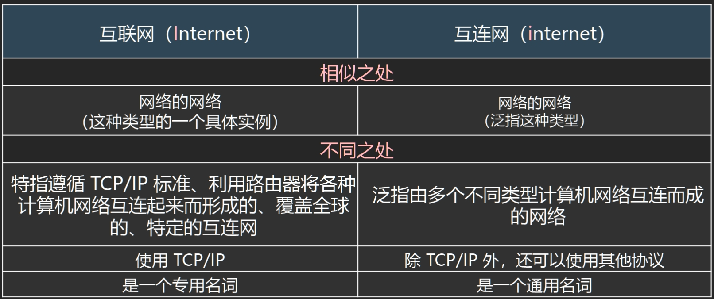
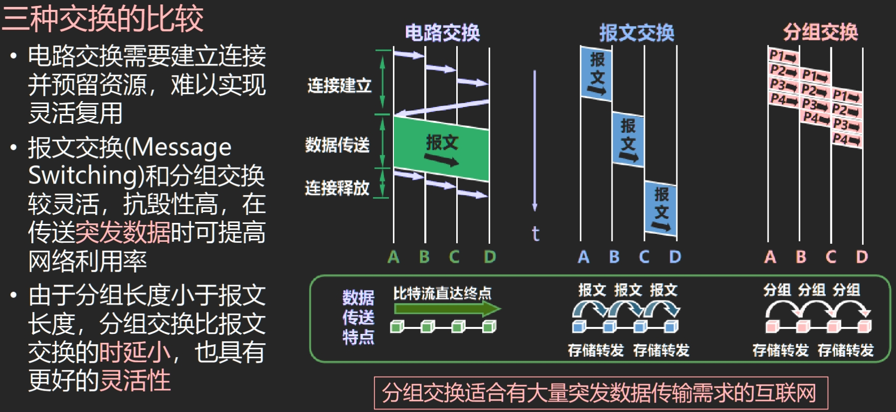
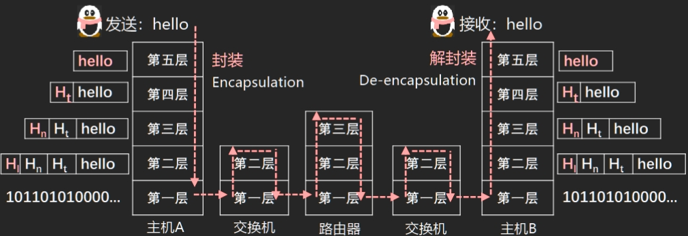
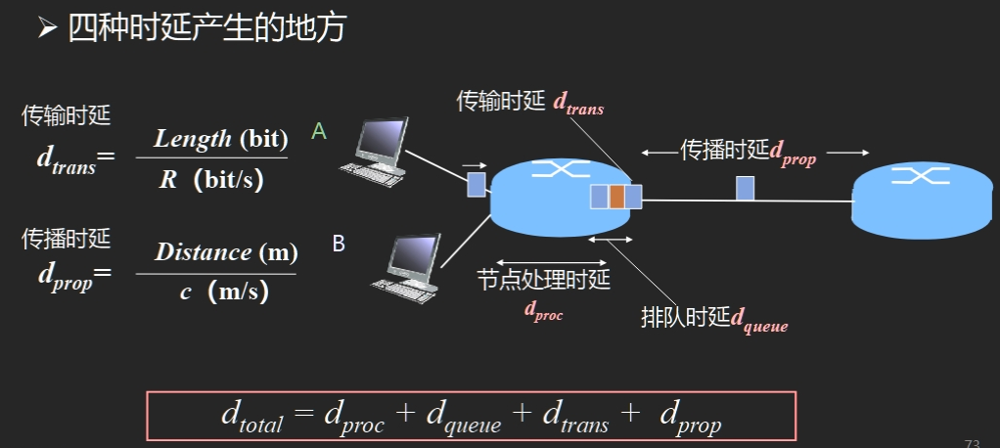

# 计算机网络 Computer Network

> [!WARNING]
>
> ➢平时成绩50% = 课程作业 7-8次 + 课程实验 6次 + 出勤+quiz 3-4 次
> ➢ 期末考试50% (闭卷) 试卷为英文

> [!TIP]
>
> https://zjucomp.net/docs/terms 术语中英对照表

## 引言

###  初识互联网

网络的基本功能：传递信息

服务用什么区分？

- 功能、延迟、带宽、丢失率
- 端节点数目、服务接口
- 可靠性、实时/非实时等外特性

### 网络实例

#### 网络分类（按地域规模）

- 个域网PAN（ Personal Area Network ）：能在便携式消费电器与通信设备之间进行短距离通信的网络；覆盖范围一般在10米半径以内，如蓝牙耳机等
-  局域网LAN（Local Area Network）：局部地区形成的区域网络，如企业网络；分布地区范围有限，可大可小，大到一栋建筑、小到办公室内的组网；电脑WLAN接入，打印机共享等等
- 城域网MAN（Metropolitan Area Network ）：范围覆盖一个城市的网络
- 广域网WAN（Wide Area Network）：覆盖很大地理区域，乃至覆盖地区和国家

ISP：Internet服务商

IXP或IX：互联网交换点

#### 网络组成

##### 网络边缘

**端系统**：位于互联网边缘与互联网相连的计算机和其他设备

- 端系统由各类主机(host)构成：桌面计算机、移动计算机、服务器、其他智能终端设备

##### 网络核心

由互联端系统的分组交换设备和通信链路构成的网状网络

###### 接入网

- 接入网的目标是将主机连接到边缘路由器上
- 边缘路由器是端系统Host去往任何其他远程端系统的路径上的第一台路由器

*各种异构网络通过边缘路由器接入*

- 光纤到户FTTH：Firber to the home
- 数字用户线DSL：Digital Subscriber Line
- 同轴电缆：Cable
- 无线接入
  - 无线局域网WLAN
  - 广域蜂窝接入网

传输单位：bit

> [!WARNING]
>
> 存储常用字节ByteK/M/G层级为2^10进制
> 传输常用比特BitK/M/G层级为10^3进制
>
> 1B=8b （注意大小写）

物理媒介

- 是指发射机和接收机之间的具体链路介质
- 引导型介质：信号在固体介质中传播，例如铜、光纤、同轴电缆
- 非引导型介质：信号自由传播，包括无线电（陆地无线电、卫星无线电信道）、无线链路类型（无线局域网（WiFi）、广域（如3/4/5G蜂窝）蓝牙、地面微波、卫星）

###### 网络核心两大功能

###### 分组交换和电路交换

分组交换（也称包交换 packet switching）

- 主机将数据分成分组，发送到网络，通信双方以分组为单位、使用存储-转发机制，实现数据交互的通信方式
- 网络将数据分组从一个路由器转发到下一个路由器，通过从源到目标的路径上的链路，逐跳传输抵达目的地
- 每个分组在互联网中独立的选择传输路径
- 支持灵活的统计多路复用 multiplexing
- 到达包的顺序和发送顺序可能不一致

电路交换（circuit switching）

- 资源预留，不会被抢占 -> 有序、性能有保障
- 容错性低（无法应对互联网中广泛存在的“突发”（Burst）流量）
- 资源利用不够充分

存储转发的报文交换

- 路由器需要接收到完整的整个数据报文后，才能开始向下一跳发送
- 有传输延迟

分组交换在实际应用率最高

### 协议和分层结构

分层协议 layered protocol

#### 协议设计目的

- 可靠性、资源分配、拥塞问题、自适应性、安全问题

##### 统一标准

- 明晰简化，便于分析学习
- 各层独立，加速技术演进
- 统一接口，确保技术互通（interoperable）

##### 模块独立

##### 分层结构

发送端：层层封装；接收端：层层解封装

不同层对应协议数据单元（PDU Protocol Data Unit）

从顶层到底层，每一层Header往前加，后面（前一层的header等）都是数据

#### 服务原语

服务原语 Service Primitives

- 面向连接（电话系统）/无连接（邮政系统）

#### 服务与协议的关系

==协议是“水平”的，服务是“垂直”的==

➢ 实体使用协议来实现其定义的服务
➢ 上层实体通过接口使用下层实体的服务

### 参考模型

#### OSI参考模型

OSI：Open Systems Interconnection

**7层模型：从下到上，物理层、数据链路层、网络层、传输层、会话层、表示层、应用层**

##### 物理层（Physical Layer）

定义如何在信道上传输0、1：Bits on the wire

##### 数据链路层 (Data Link Layer)

实现相邻（Neighboring）网络实体间的数据传输

成帧（Framing）：从物理层的比特流中提取出完整的帧

物理地址（MAC address）：48位，理论上唯一网络标识，烧录在网卡，不便更改

共享信道上的访问控制（MAC）：同一个信道，同时传输信号。

##### 网络层 (Network Layer)

将数据包跨越网络从源设备发送到目的设备（host to host）

路由（Routing）：在网络中选取从源端到目的端转发路径，常常会根据网络可达性动态选取最佳路径，也可以使用静态路由

网络层的控制主要面向运营商

> [!NOTE]
>
> 为什么除了MAC地址外，还有IP地址？不能用MAC（网卡地址）寻址，路由器不知道网卡在哪；？？面向运营商（第一节课）

##### 传输层 (Transport Layer)

将数据从源端口发送到目的端口（进程到进程）

传输层为终端用户提供端到端的数据传输控制

两类模式：可靠的传输模式，或不可靠传输模式

- 可靠传输：可靠的端到端数据传输，适合于对通信质量有要求的应用场景，如文件传输等
- 不可靠传输：更快捷、更轻量的端到端数据传输，适合于对通信质量要求不高，对通信响应速度要求高的应用场景，如语音对话、视频会议等

##### 会话层 (Session Layer)

利用传输层提供的服务，在应用程序之间建立和维持会
话，并能使会话获得同步

##### 表示层（Presentation Layer）

关注所传递信息的语法和语义，管理数据的表示方法，
传输的数据结构

##### 应用层（Application Layer）

通过应用层协议，提供应用程序便捷的网络服务调用

#### TCP/IP参考模型

**4个层!**

➢ 链路层（Link Layer）

- 描述了为满足无连接的互联网络层需求，链路必须具备的功能

➢ 互联网层（Internet Layer）

- 允许主机将数据包注入网络，让这些数据包独立的传输至目的地，并定义了数据包格式和协议（IPv4协议和IPv6协议）

➢ 传输层（Transport Layer）

- 允许源主机与目标主机上的对等实体，进行端到端的数据传输：TCP，UDP

➢ 应用层（Application Layer）

- 传输层之上的所有高层协议：DNS、HTTP、FTP、SMTP

> [!NOTE]
>
> 先有TCP/IP协议栈，然后有TCP/IP参考模型
>
> 参考模型只是用来描述协议栈的
>
> ARPNET最终采用TCP和IP为主要协议

#### OSI模型TCP/IP模型对比

> [!IMPORTANT]
>
> 本课程采用5层模型，物理层、数据链路层、网络层、传输层、应用层

#### 模型与网络实例

Host上每个层都有

交换机不解析IP地址，只处理MAC地址

路由器处理网络地址（IP地址） 

### 计算机网络度量单位

#####  比特率(bit rate)

• 主机在数字信道上传送数据的速率，也称数据率
• 比特率的单位是b/s(比特每秒)，也可以写为bps，(bit per second)，或 kbit/s、Mbit/s、 Gbit/s等

##### 带宽

• 网络中某通道传送数据的能力，即单位时间内网络中的某信道所能通过的“最高数据率”
• 单位是 bit/s，即 “比特每秒”

##### 包转发率(PPS)

• 全称是Packet Per Second(包/秒)，表示交换机或
路由器等网络设备以包为单位的转发速率
• 线速转发（line speed）：交换机端口在满负载的情况下，对帧进行转发时能够达到该端口线路的最高速度

> [!NOTE]
>
> 在交换机上：大包和小包，哪个更容易实现线速？小的

##### 时延(Delay)

时延 (delay 或 latency) 是指数据（一个报文或分组）从网络（或链路）的一端传送到另一端所需的时间，也称为延迟
• 传输时延(transmission delay)：数据从结点进入到传输媒体所需要的时间，传输时延又称为发送时延
• 传播时延(propagation delay)：电磁波在信道中需要传播一定距离而花费的时间
• 处理时延(processing delay)：主机或路由器在收到分组时，为处理分组（例如分析首部、提取数据、差错检验或查找路由）所花费的时间
• 排队时延(queueing delay)：分组在路由器输入输出队列中排队等待处理所经历的时延 -> queue不长不短最好

##### 往返时延RTT(Round-Trip Time)

• 从发送方发送数据开始，到发送方收到来自接收方的确认，经历的总时间
• 可用于判断网络的通断性、测试网络时延、计算数据包丢失率等

##### 时延带宽积

时延带宽积 = 传播时延 * 带宽，即按比特计数的链路长度

EG:传播时延为20ms，带宽为10Mb/s，则：
	时延带宽积= 20/1000 × 10×106 = 2 × 105 bit

吞吐量 throughput

有效吞吐量 goodput

利用率

丢包率

### 网络安全威胁

恶意软件、病毒、蠕虫

##### 拒绝服务攻击(Denial-of-Service (DoS) attack)

攻击者通过制造大量虚假流量占用资源

使合法流量无法使用资源(服务、带宽

##### 僵尸网络 （Botnet）

采用一种或多种传播手段，将大量主机感染bot程序（僵尸程序）病毒，从而在控制者和被感染主机之间所形成的一个可一对多控制的网络
➢ 分布式DoS攻击的发起者，往往通过僵尸网络发起攻击，从而躲避追查

##### 如何防御

➢ 身份验证：证明你就是你！
➢ 保密：加密技术
➢ 完整性检查：数字签名检测/防止篡改
➢ 访问限制：受密码保护的VPN
➢ 防火墙：接入网络和核心网络中的专用“安全卫士”

### 标准化组织

ISO

ITO

IEEE

WFA

IETF

IRTF(Interent research of )

- RFC(request for comments)标准

### 互联网发展史与启示

1983 ARPANET采用TCP/IP——标志互联网诞生

## 物理层

### 物理层基本概念

#### 物理层功能

**位置**：物理层是网络体系结构中的最低层

> [!WARNING]
>
> 不是连接计算机的具体物理设备，不是负责信号传输的具体物理媒体

**功能**：如何在连接各计算机的传输媒体上*传输数据比特流*

**作用**：尽可能地*屏蔽掉不同传输媒体和通信手段的差异*

#### 物理层特性

##### 物理层机械特性

涉及接口的物理结构，通常采用接线器来实现机械上的连接

**定义**接线器的**形状和尺寸、引线数目和排列、固定和锁定装置**等

##### 物理层电气特性

规定了多条信号线的电气连接及有关电路特性
• 发送器和接收器的电路特性、负载要求、传输速率和连接距离等
• 如发送信号电平、发送器和接收器的输出阻抗、平衡特性等

##### 物理层功能特性

描述接口执行的功能，定义接线器的每一引脚(针，Pin)的作用

##### 物理层过程特性

指明对于不同功能的各种可能事件的出现顺序

#### 物理层标准及示例

**点对点通信线路**用于直接连接两个结点

广播通信线路

### 数据通信基础

#### 数据通信基础理论

##### 傅里叶分析

任何一个周期为T的有理周期性函数 g(t) 可分解为若干项（可能无限多
项）正弦和余弦函数之和
$$
g(t)=c+\sum_{n=1}^∞{a_nsin(2Πnft)}+\sum_{n=1}^∞{b_ncos(2Πnft)}
$$
f = 1/T 基本频率

a~n~, b~n~ n次谐波项的正弦和余弦振幅值

##### 有限带宽信号

信号在信道上传输时的特性
• 对不同傅立叶分量的衰减不同，引起输出失真
• 信道有**截止频率fc** , 0 ~ fc的振幅衰减较弱， fc以上的振幅衰减厉害，这主要由信道的物理特性决定， **0 ~ fc是信道的有限带宽**
• 实际使用时，可以接入滤波器，限制用户的带宽
• 通过信道的**谐波次数N越多，信号越逼真**
EG：

#### 信道的最大数据传输速率

**奈魁斯特定理**

**无噪声**有限带宽信道的最大数据传输率公式

• 最大数据传输率 = $2Hlog_2V$​ (bps)
• 任意信号通过一个*带宽为Ｈ*的低通滤波器，则*每秒采样2H次（频率）*就能完整地重现该信号（无损！），*信号电平分为V级*

> [!NOTE]
>
> Symbol rate vs. Data rate
>
> symbol代表若干个比特，symbol rate又叫baud rate
>
> data rate = symbol rate * bits per symbol
>
> **The modulation technique determines the number of bits/symbol**

随机噪声出现的大小用**信噪比**（**信号功率S**与**噪声功率N**之比）来衡量

- 信噪比=$10log_{10}S/N$，单位：分贝db

**香农定理**

带宽为*H赫兹*，*信噪比为S/N*的任意信道的**最大数据传输率**为：$$Hlog_2(1 + S/N)$$ (bps)
• 此式是利用信息论得出的，具有普遍意义
• 与信号电平级数、采样速度无关
• 此式仅是上限，难以达到

**信息量**

一条消息包含信息的多少称为信息量

- 信息量的大小与消息所描述事件的出现概率有关
- 一条消息所荷载的**信息量**等于它所表示的事件发生的**概率p**的倒数的对数$I=log_a{\frac{1}{p}}=-log_ap$
  - a表示进制，a=2时，I的单位为比特；a=自然数e，I的单位为奈特，通常用**比特**作为信息量的单位

#### 数据通信系统模型

信号是消息的载体

##### 传输方式

- 串行、并行
- 点到点/点到多点
- 单工（sender—>receiver，方向指定）、半双工（双向但不能同时）、全双工（双向可同时）
- 基带传输、频带传输

##### 数据编码技术

1. 不归零制码（NRZ：Non-Return to Zero）
   • 原理：用两种不同的电平分别表示二进制信息“0”和“1”，低电平表示“0”，高电平表示“1”
   • 缺点：难以分辨一位的结束和另一位的开始；发送方和接收方必须有时钟同步；若信号中“0”或“1”连续出现，信号直流分量将累加
   • 结论：容易产生传播错误
2. 曼彻斯特码（Manchester），也称相位编码
   • 原理：每一位中间都有一个跳变，从低跳到高表示“0”，从高跳到低表示“1”
   • 优点：克服了NRZ码的不足。每位中间的跳变即可作为数据，又可作为时钟，能够自同步
3. 差分曼彻斯特码（Differential Manchester）
   • 原理：每一位中间都有一个跳变，每位开始时有跳变表示“0”，无跳变表示“1”。位中间跳变表示时钟，位前跳变表示数据
   • 优点：时钟、数据分离，便于提取

频带传输

**三种调制技术**：载波 Asin(ωt + φ)的三个特性幅度、频率、相位

• 幅移键控法（调幅） Amplitude-shift keying (ASK)
	幅移就是把频率、相位作为常量，而把振幅作为变量
• 频移键控法 （调频）Frequency-shift keying (FSK)
	频移就是把振幅、相位作为常量，而把频率作为变量
• 相移键控法（调相） Phase-shift keying (PSK)
	相移就是把振幅、频率作为常量，而把相位作为变量

常见调制方式：

BPSK：使用了基准的正弦波和相位反转的波浪，使一方为0，另一方为1，从而可以同时传送接受2值(1比特)的信息

QPSK：一种四进制相位调，制采用移相方式QPSK，每个点2比特信息，具有良好的抗噪特性和频带利用率通信业

QAM：正交幅度调制是是一种数字调制方式，产生的方法有正交调幅法和复合相移，16QAM是指包含16种符号的QAM调制方式（用4个symbol）

### 传输介质

#### 分类

##### 导引性介质

指电磁波被导向沿着某一媒体传播，包括双绞线、同轴电缆、电力线和光纤等

###### 磁介质(magnetic tape)

- 顺序读写

- Bandwidth 带宽 = 800GB/tape * 1000 tapes/box / (24×60×60s) = 70+Gbps

- Cost = (800GB/tape × 1000tapes/box) / 5000\$ = 160GB/$

> Never underestimate the bandwidth of station wagon full of tapes hurtling down the highway. 带宽很大，但延迟多

###### 双绞线（网线）

- 绞合密度、扭绞方向和绝缘材料等因素影响双绞线的特性阻抗、衰减和近端串扰

###### 同轴电缆

- 寿命长、容量大、传输稳定、外界干扰小、维护方便等优点

###### 光纤

- 双层或多层同心园柱体（类似同轴电缆），由纤芯、包层和护套组成
- 三种实用光纤
  - 单模 纤芯直径很小，折射率分布属于突变型 带宽极大，适用于大容量远距离通信
  - 多模突变 带宽较窄，适用于小容量短距离通信
  - 多模渐变 纤带宽较宽，适用于中容量中距离通信

光纤损耗和波长有关系，三个窗口

光纤损耗分为

- 固有损耗指光纤材料的性质和微观结构引起的吸收损耗和瑞利散射损耗
- 非固有损耗指杂质吸收、结构不规则引起的散射和弯曲幅射损耗等

###### 电力载波

电力载波是电力系统特有的通信方式

- 利用现有电力线，通过载波方式将模拟或数字信号进行高速传输

- 交流电信号+信号=调制信号

优点：投资少、连接方便、传输速率高、安全性好和使用范围广

缺点：无法提供高质量的数据传输业务，如家庭电器产生的电磁波干扰等

##### 非导引性介质

指电磁波在大气层、外层空间或海洋中进行的无线传播，包括短波传输、地面微波、卫星微波、光波传输等

###### 短波传输（无线电波）

100m～10m 波长长->绕射能力强->传播距离远

多径传播：短波电波通过若干条路径或者不同的传播模式由发信点到达收信点的长度不同，而引起由发信点到达收信点的时间不同的现象

多径时散：指不同路径的时延差；与路径长度、工作频率、昼夜、季节等因素有关

- 多径时散对数据通信的影响主要体现在码间干扰
- 为了保证传输质量，往往采用限制数据传输速率的措施

散射传输：利用大气层中传输媒体的不均匀性对无线电波的散射作用进

行的超视距通信

###### 微波

1m～1mm

多路复用、射频工作和中继接力是地面微波传输的三个最基本的工作特点

波长 m * 频率 Hz = 速度 m/s

###### 光波

3×10^2^～60×10^4^μm

分类

- 按照光源特性的不同，分为激光通信和非激光通信
- 按照传输媒体的不同，分为大气激光通信和光纤通信
- 按照传输波段的不同，光波通信分为可见光通信、红外线（光）通信和紫外线（光）通信

大气激光通信可传输语音、数据、图像等信息

• 具有抗干扰性好、设备轻便、保密性强、机动性

• 但使用时收、发天线相互对准较为困难，通信距离限于视距范围

• 易受气候影响，尤其在恶劣气候条件下会造成通信中断

###### 红外线

不可见光，其波长范围760nm~4.0*10^5^nm

### 无线与卫星通信

**无线传输：**可以在自由空间利用电磁波发送和接收信号进行通信

**无线电波**：指在自由空间（包括空气和真空）传播的射频频段的电磁

波

**卫星通信**:利用人造地球卫星作为中继站，转发或反射无线电波，在两

个或多个地球站之间进行的通信

特点

- 传播时延长，从一个地球站经卫星到另一个地球站的电波传播传播时间约需240～280ms（可取270ms） 
- 传播损耗大，达200dB左右
- 受大气层的影响大
- “面覆盖”式的传播信道

卫星通信的缺点

• 传输时延大：500毫秒~800毫秒的时延

• 高纬度地区难以实现卫星通信

• 为了避免各卫星通信系统之间的相互干扰，同步轨道的星位是有一点限度的，不能无限制地增加卫星数量

• 太空中的日凌现象和星食现象会中断和影响卫星通信

**移动卫星通信**

静止轨道~

中轨道~

低轨道~(LEO)

- 信号传输时延小
- 地面终端设备简单、造价低，是手持式终端的最佳方式
- 卫星造价低、发射容易

### 多路复用技术

复用 (multiplexing) 技术的目的是：允许用户使用一个共享信

道进行通信，避免相互干扰，降低成本，提高利用率。

#### 频分复用(FDM)

频分复用（Frequency-division multiplexing），是一种将多路基带信号调制到不同频率载波上，再进行叠加形成一个复合信号的多路复用技术

频分复用的所有用户在同样的时间*占用不同的带宽资源*（请注意，这里的“带宽”是**频率带宽**而不是数据的**发送速率**）

#### 时分复用(TDM)与统计时分复用(STDM)

**时分复用**(Time Division Multiplexing)是将时间划分为一段段等长的时分复用帧

- 每一个时分复用的用户在每一个 TDM 帧中占用固定序号的时
- 每一个用户所占用的时隙是周期性地出现（其周期就是TDM帧的长度）的。
- TDM 信号也称为等时 (isochronous) 信号。
- 时分复用的所有用户在*不同的时间*占用**同样的频带宽度**
- **存在的不足：**使用时分复用系统传送计算机数据时，由于计算机数据的突发性质，用户对分配到的子信道的利用率一般是不高的

**统计时分复用**（statistical time division multiplexing）是指动态地按需分配共用信道的时隙，只将需要传送数据的终端接入共用信道，以提高信道利用率的多路复用技术

#### 波分复用(WDM)

**波分复用**（Wavelength Division Multiplexing，WDM）是利用*多个*激光器在*单条*光纤上同时发送*多束不同波长激光*的技术

#### 码分复用(CDMA)

码分多址 (Code Division Multiple Access，CDMA)是指利用码序列相关性实现的多址通信 , 基本思想是靠**不同的地址码**来区分的地址

- 各用户使用经过特殊挑选的不同码型，因此彼此不会造成干扰
- 这种系统发送的信号有很强的抗干扰能力，其频谱类似于白噪声，不易被敌人发现

**码片序列的正交关系**

正交就是向量 S 和T 的规格化内积 (inner product) 等于 0

**码片序列实现了扩频(spread spectrum)**

假定S站要发送信息的数据率为 *b* bit/s。由于每一个比特要转换成 *m* 个比特的码片，因此 S 站实际上发送的数据率提高到 *mb* bit/s，同时 S 站所占用的频带宽度也提高到原来数值的 *m* 倍

#### 正交频分复用(OFDM)

正交频分复用（Orthogonal Frequency Division Multiplexing，OFDM)

- 将信道分成若干正交子信道
- 将高速数据信号转换成并行的低速子数据流，调制到在每个子信道上进行传输

问题：

Wideband (e.g., 10MHz) ==> short symbol time (e.g., 0.1µs) 

• Delay spread caused by multipath transmission: about 1µs ==> 0.1µs << 1µs ==> severe inter-symbol interference (ISI)

解决方法：

Divide the wideband into many narrow bands, each with a carrier (i.e., subcarrier)宽带变窄带

For example：10MHz --> 100 subcarriers --> symbol time 10µs --> 10µs >> delay spread (1µs) --> smaller ISI

- Multi-carrier modulation 

#### 空分复用

## 数据链路层基础

### 数据链路层的设计问题

#### 数据链路层在协议栈中的位置

向下：利用物理层提供的位流服务

向上：向网络层提供明确的 (well-defined) 服务接口

#### 数据链路层的功能

**成帧（Framing）**

- 将比特流划分成“帧”的主要目的是为了检测和纠正物理层在比特传输中可能出现的错误，数据链路层功能需借助“帧”的各个域来实现

**差错控制（Error Control）** 

- 处理传输中出现的差错，如位错误、丢失等

流量控制（Flow Control） （重点前两个）

- 确保发送方的发送速率，不大于接收方的处理速率
- 避免接收缓冲区溢出

#### 数据链路层提供的服务

无确认无连接（ Unacknowledged connectionless ） 

• 接收方不对收到的帧进行确认

• 适用场景：误码率低的可靠信道；实时通信（延迟低）

• 网络实例：以太网

有确认无连接（ Acknowledged connectionless ） 

• 每一帧都得到单独的确认

• 适用场景：不可靠的信道（无线信道）

• 网络实例：802.11

有确认有连接（ Acknowledged connection-oriented ） 

• 适用场景：长延迟的不可靠信道，例如卫星通信

#### 成帧 framing

**定界符**标识一个帧的开始

- **字节计数法**（ Byte count ） ：无差错传输的情形，现实中很少用（多米诺骨牌式错误

  - 

- **带字节填充的定界符法**（ Flag bytes with byte stuffing）

  - 定界符：一个特殊的字节，比如 01111110，即 0x7E，用于区分前后两个不同的帧
  - 发送发将数据（有效载荷）中加入*转义字符*加以区分
    
  - 接收方逐个检查收到的每一个字节
    - 收到ESC，则后一字节无条件成为有效载荷，不予检查
    - 收到FLAG，则为帧的边界

  > 不足：overhead 开销大、效率低

- **带比特填充的定界符法**（ Flag bits with bit stuffing ）

  - 定界符：两个0比特之间，连续6个1比特，即01111110，0x7E
  - 发送方在数据（有效载荷）中出现连续5个1比特，则直接插入1个0比特 -->*数据中不会出现定界符*
  - 接收方若出现连续5个1比特
    - 若下一比特为0，则为有效载荷，直接丢弃0比特
    - 若下一比特为1，则连同后一比特的0，构成定界符，一帧结束

- **物理层编码违例**（ Physical layer coding violations ）

  - • 核心思想：选择的定界符不会在数据部分出现

#### 差错控制

链路层存在的一个问题：信道的噪声导致数据传输问题

• 差错（ incorrect ）：数据发生错误

• 丢失（ lost ）：接收方未收到

• 乱序（out of order）：先发后到，后发先到

• 重复（repeatedly delivery）：一次发送，多次接收

 解决方案：差错检测与纠正、确认重传

• 确认：接收方校验数据（差错校验），并给发送方应答，防止差错

• 定时器：发送方启动定时器，防止丢失

• 顺序号：接收方检查序号，防止乱序递交、重复递交

#### 流量控制

链路层存在的另一个问题：接收方的处理速率

• 接收方的接收缓冲区溢出

 解决方案

• 基于反馈 (feedback-based) 的流量控制

• 接收方反馈，发送方调整发送速率

• 基于速率 (rate-based) 的流量控制

• 发送方根据内建机制，自行限速

### 差错检测和纠正

通常采用增加冗余信息（或称校验信息）的策略

- 示例：每个比特传三份，如果每比特的三份中有一位出错，可以纠正

#### 检错码（error-detecting code） 

在被发送的数据块中，包含一些冗余信息，但这些信息只能使接收方推断是否发生错误，但不能推断哪位发生错误，接收方可以请求发送方重传数据

- 主要用在**高可靠、误码率较低**的信道上，例如光纤链路
- 偶尔发生的差错，可以通过重传解决差错问题

#### 纠错码（error-correcting code)

发送方在每个数据块中加入足够的冗余信息，使得接收方能够判断接收到的数据是否有错，并能纠正错误（*定位出错的位置*） 

- 主要用于**错误发生比较频繁**的信道上，如无线链路
- 也经常用于物理层，以及更高层（例如，实时流媒体应用和内容分发）
- 使用纠错码的技术通常称为*前向纠错*（FEC，Forward Error Correction)

**码字 (code word)**：一个包含m个数据位和r个校验位的n位单元，描述为 (n, m) 码，n=m+r

**码率 (code rate)**：码字中不含冗余部分所占的比例，可以用m/n表示

#### 海明距离 (Hamming distance)

给定m的条件下，纠正单个错误所需校验位数的下限：$m+r+1≤2^r$

- m为消息位个数，r为校验位个数

**两个码字的海明距离**：两个码字之间不同对应比特的数目

- 例：0000000000 与0000011111的海明距离为5 
- 如果两个码字的海明距离为d，则需要d个单比特错就可以把一个码字转换成另一个码字 

**一种编码方案（code）的海明距离**

- 该编码方案中**任意**两个**合法**码字的**最小**海明距离

==The error-detection and error-correcting properties of a code depend on its Hamming distance.== 代码的错误检测和纠错特性取决于其海明距离

To use Hamming distance to correct *d* errors: you need *2d*+1 Hamming distance code. 用海明距离纠正d个错误需要2d+1个距离码

-----------------

图3-6纠正1位错误的海明码：海明距离为3，可以纠正1个错误或者检测两个错误

#### 典型检错码

常用的检错码包括：

- 奇偶检验 (Parity Check)：1位奇偶校验是最简单、最基础的检错码
- 校验和 (Checksum)：主要用于TCP/IP体系中的网络层和传输层
- 循环冗余校验 (Cyclic Redundancy Check，CRC)：数据链路层广泛使用的校验方法，crc只能检错不能纠错

##### 奇偶校验

1位奇偶校验：增加1位校验位，**可以检查奇数位错误**

-> 1个bit的错误

- 偶校验：保证1的个数为偶数个
- 奇校验：保证1的个数为奇数个

##### 校验和

##### 循环冗余校验CRC

> [!NOTE]
>
> 

#### 海明码 hamming code

纠正

按列发，每行最多错一位，可以纠正

[最通俗易懂的海明码校验纠错讲解_海明码纠错-CSDN博客](https://blog.csdn.net/hamster204/article/details/90748043)

#### 卷积码 Convolutional Code

​						

#### Trellis diagram

> 
>
> S0->S2->S3->S1 输出state 00 11 01 01 原始数据：0 1 1 0

### 基本的数据链路层协议

#### 关键假设

 分层进程独立假设

• 网络层、数据链路层、物理层为独立的进程

• 进程间通过传递消息实现通信

 提供可靠服务假设

• 提供可靠的、面向连接的服务

• 数据链路层发送的数据随时可向网络层获得

 只处理通信错误假设

• 仅处理通信错误

• 假设机器不会崩溃，不考虑断电、重启等引起的问题

#### 基本的协议定义

#### 乌托邦式单工协议

假设

• 单工（Simplex）协议：数据单向传输

• 完美信道：帧不会丢失或受损

• 始终就绪：发送方/接收方的网络层始终处于就绪状态

• 瞬间完成：发送方/接收方能够生成/处理无穷多的数据

 乌托邦：完美但不现实的协议

• 不处理任何流量控制或纠错工作

• 接近于无确认的无连接服务，必须依赖更高层次解决上述问题

#### 无错信道单工停止-等待协议

不再假设

• 接收方能够处理以无限高速进来的数据

• 发送方以高于接收方能处理到达帧的速度发送帧，导致接收方被“淹

没”(overwhelming)

 仍然假设

• 通信信道不会出错（Error-Free） 

• 数据传输保持单向, 但是需要双向传输链路（半双工物理信道）

#### 有错信道单工停止-等待协议

➡️假设

• 通信信道可能会出错，导致：

−帧在传输过程中可能会被损坏，接收方能够检测出来

−帧在传输过程中可能会丢失 ，永远不可能到达接收方

➡️一个简单的解决方案

• 发送方增加一个*计时器(timer)*，如果经过一段时间没有收到确认，发送方将超时，于是再次发送该帧

stop and wait

**效率的评估**

F = frame size (bits) 
R = channel capacity (Bandwidth in bits/second)
I = propagation delay + processor service time (second)

• 每帧发送时间 (Time to transmit a single frame) = F/R

• 总延迟 (Total Delay) = D =2I

• 停止等待协议的发送工作时间是F/C，空闲时间是D 

当 F<D 时：==信道利用率 (line utilization)=F/(F+R·D) < 50%==

#### 停等协议的性能问题

 停止-等待机制降低了信道利用率

• 设数据速率记为R，帧长度记为F，往返延迟记为D，则采用停-等协议的

线路效率为：F/(F+R·D)

• 假如将链路看成是一根管道，数据是管道中流动的水，那么在传输延迟

较长的信道上，停-等协议无法使数据充满管道，因而信道利用率很低

 解决办法

• 流水线协议或管道协议：允许发送方在没收到确认前连续发送多个帧

### 滑动窗口协议

#### 滑动窗口协议

窗口机制

− 发送方和接收方都具有一定容量的缓冲区（即窗口），发送端在收到确认

之前可以发送多个帧

目的

• 对可以连续发出的最多帧数（已发出但未确认的帧）作限制

 序号使用

• 循环重复使用有限的帧序号

 流量控制：接收窗口驱动发送窗口的转动

• 发送窗口：其大小记作WT，表示在收到对方确认的信息之前，可以连续发出的最多数

据帧数

• 接收窗口：其大小记作WR ，为可以连续接收的最多数据帧数

 累计确认：不必对收到的分组逐个发送确认，而是对按序到达的最后一个分组发送确认

收到，前窗口后移，后窗口不动；发出确认后，后窗口才后移

#### 回退N协议（协议5）

##### 协议原理分析

出错全部重发

• 当接收端收到一个出错帧或乱序帧时，丢弃所有的后继帧，并且不为这

些帧发送确认

• 发送端超时后，重传所有未被确认的帧

 适用场景

• 该策略对应接收窗口为1的情况，即只能按顺序接收帧

 优缺点

• 优点：连续发送提高了信道利用率

• 缺点：按序接收，出错后即便有正确帧到达也丢弃重传

##### 协议的实现分析

#### 选择重传协议 select and repeat（协议6）

若发送方发出连续的若干帧后，收到对其中某一帧的否认帧，或某一帧的定时器超时，则**只重传该出错帧或计时器超时的数据帧**

该策略对应接收窗口大于1的情况，即暂存接收窗口中序号在出错帧之后的数据帧

- 优点：避免重传已正确传送的帧
- 缺点：在接收端需要占用一定容量的缓存

##### 基本原理

• 在发送过程中，如果一个数据帧计时器**超时**，就认为该帧丢失或者被破坏；**接收端只把出错的的帧丢弃，其后面的数据帧保存在缓存中**，并向发送端回复NAK；发送端接收到NAK时，**只重传出错的帧**

• 如果**落在窗口内的帧**从未接受过，那么存储起来，等比它序列号小的所有帧都正确接收后，按次序交付给网络层

• 接收端收到的数据包的顺序可能和发送的数据包顺序不一样，因此在数据包里必须含有**顺序号**来帮助接收端进行排序。

没有累计确认的机制

滑动窗口长度

- 发送窗口的尺寸：$$W^T ≤2^{n-1}$$​,发送窗口应等于或小于序号空间的一半

##### 协议实现分析

发送方必须响应的三件事

- 上层的调用：检测有没有可以使用的序号，如果有就发送
- 收到ACK：如果收到的是最小序号的ACK，窗口滑动。如果收到其他序号的ACK，进行标记
- 超时事件：每个PDU都有定时器，哪个超时重传哪个

### 数据链路协议实例

#### 点到点链路层协议PPP

PPP协议是目前使用最多的数据链路层协议之一

能够在不同的链路上运行；能够承载不同的网络层分组

特点：简单、灵活

##### PPP协议实现的功能

##### PPP协议未实现的功能

帧数据的纠错功能

- 数据链路层的PPP协议**只进行检错**，PPP协议是不可靠传输协议

流量控制功能

- PPP协议未实现点到点的流量控制

可靠传输功能

- PPP为**不可靠协议**，不使用帧的序号。不可靠网络中可能使用有序号的工作方式。

多点连接功能

- PPP协议不支持多点线路，**只支持点对点**的链路通信。

单工和半双工链路

- PPP协议支持全双工链路

##### PPP协议的构成

封装 (Encapsulation)

- 提供在同一链路上支持不同的网络层协议
- PPP既支持异步链路（无奇偶检验的8比特数据），也支持面向比特的同步链路
- IP数据包在PPP帧中是其信息部分，其长度受到MTU的限制

链路控制协议 LCP (Link Control Protocol)。 

- 用来建立、配置和测试数据链路的链路控制协议，通信双方可协商一些选项

网络控制协议 NCP (Network Control Protocol)。 

- 其中每个协议支持一种不同的网络层协议，如IP、OSI的网络层、DECnet、AppleTalk等

##### PPP协议的帧格式

1.字节填充

避免在信息字段中出现和**标志字段**一样的比特组合（FLAG为0X7E） 

当PPP使用**异步传输**时，定义**转义字符**0X7D，并使用字节填充（ESC为0X7D）

- 将信息字段中出现的0x7E 字节转变成为2字节序列(0x7D, 0x5E)

2.零比特填充

PPP协议用在SONET/SDH链路时，使用**同步传输**（一连串的比特连续传送），不是异步传输（逐个字符地传送）

> 异步传输是面向字符的传输，而同步传输是面向比特的传输

#### PPPoE

Ethernet优点：原理简单，应用非常广，设备成本低

Ethernet缺点：安全性较低、不宜管理：使用广播信道，造成了安全性较低，无认证功能

PPP优点：

- 原理简单
- 安全性高：点对点信道，提供认证机制
- 提供良好的访问控制和计费功能

==>结合变成 PPPoE(Point-to-Point Protocol over Ethernet)

- 提供在以太网链路上的PPP连接
- 实现了传统以太网不能提供的身份验证、加密，以及压缩等功能
- 实现基于用户的访问控制、计费、业务类型分类等，运营商广泛支持
- PPPoE使用Client/Server模型，服务器通常是接入服务器

## 介质访问子层

> 介质访问子层在数据链路层的下面

###  信道分配问题

#### 子信道的平均延迟

**信道N等分后每个子信道平均延迟时间会增加**（有害，增加N倍

#### 静态分配的特点

问题：资源分配不合理

### 多路访问协议

#### 随机访问协议

##### ALOHA协议

###### 纯ALOHA

原理：想发就发

特点：随时可能冲突

帧时：发送一个标准帧需要的时间

S 吞吐量：在发送时间T内发送成功的平均帧数，0<S<1

生成帧均值：2G (G：网络负载)

冲突危险期：2D (D：单向传播延迟)

$P_0$​ 成功传输概率：连续两个时间T内都没有生成其它帧的概率

$P_0=e^{-2G}$

纯ALOHA协议的性能：（吞吐率最大）18.4%

###### 分隙ALOHA(slotted ALOHA)

冲突危险期：D

分隙ALOHA协议的性能：（吞吐率最大）36.8%

##### 载波侦听多路访问协议(CSMA)

CSMA：Carrier Sense Multiple Access

特点：“先听后发” -> 改进ALOHA的侦听/发送策略分类

###### 非持续式CSMA

特点

①经侦听，如果介质空闲，开始发送

②如果介质忙，则等待一个随机分布的时间，然后重复步骤①

- 好处：等待一个随机时间可以减少再次碰撞冲突的可能性

- 缺点：等待时间内介质上如果没有数据传送，这段时间是浪费的

###### 持续式CSMA

特点

①经侦听，如介质空闲，则发送

②如介质忙，持续侦听，一旦空闲立即发送

③如果发生冲突，等待一个随机分布的时间再重复步骤①

- 好处：持续式的延迟时间要少于非持续式
- 缺点：如果两个以上的站等待发送，一旦介质空闲就一定会发生冲突

###### p-持续式CSMA

特点

①经侦听，如介质空闲，那么以 p 的概率发送，以**(1–p)的概率**延迟一个时间单元发送

②如介质忙，持续侦听，一旦空闲重复①

③如果发送已推迟一个时间单元，再重复步骤①

> [!NOTE]
>
> 冲突窗口

##### CSMA/CD （1-持续）

##### CSMA/CD（续）

在发完之前能知道有冲突

#### 受控访问协议

无冲突协议

##### 位图协议（预留协议）

竞争期：在自己的时槽内发送竞争比特

- 举手示意
- 资源预留

传输期：按序发送

- 明确的使用权，避免了冲突

###### 信道利用率分析

假设

• 有N个用户，需N个时隙，每帧d比特

信道利用率

- 在低负荷条件下：d/(d+N) （N越大，站点越多，利用率越低）
- 在高负荷条件下：d/(d+1)，接近100%

缺点

• 位图协议无法考虑优先级

##### 令牌

##### 二进制倒计数协议

站点：编序号，序号长度相同

竞争期：有数据发送的站点从高序号到低序号排队，高者得到发送权

特点：==高序号站点优先==

> **防止低序号站点一直抢不到发送权，可以怎样办？**
>
> 换编号 overhead

###### 信道效率分析

N个站的二进制编码所需位数是$$log_2N$$位 

信道的利用率为：$$d/(d+log_2N)$$

如果规定每个帧的帧头为发送地址，即竞争的同时也在发送。则效率为100%

#### 有限竞争协议

##### 自适应树搜索协议(Adaptive Tree Walk Protocol)

### 以太网

#### 经典以太网

##### 经典以太网的物理层

最高速率10Mbps

使用曼彻斯特编码

使用同轴电缆和中继器连接

任意两个收发器之间距离不得超过2.5km（和CSMA/CD的delay有关

且任意两个收发器之间经过的中继器不能超过4个以保证MAC协议正常工作

##### MAC子层协议

主机运行CSMA/CD协议

常用的以太网MAC帧格式有两种标准 ： 

• DIX Ethernet V2 标准（最常用的）

• IEEE 的 802.3 标准

??

#### 交换式以太网

#### 快速以太网

**fast Ethernet**( IEEE 802.3u, 1995 )

带宽：10Mbps -> 100Mbps

比特时间：100ns -> 10ns （电缆的最大长度降低到十分之一）

保留原来的工作方式（帧格式、接口、过程规则）

> [!NOTE]
>
> 名称中100Base意味着100Mbps的以太网

#### 千兆以太网

**gigabit Ethernet**( IEEE 802.3ab, 1998 )

100Mbps -> 1000Mbps( 1Gbps )

保留原来的工作方式（帧格式、接口、过程规则）

全双工和半双工两种方式工作

- 在半双工方式下使用 CSMA/CD （*为了向后兼容*），增加**载波扩充**和**帧突发**
- 全双工方式不需要使用CSMA/CD（*缺省方式*）

#### 万兆以太网

**10-Gigabit Ethernet**( IEEE 802.3ae, 2002 )

1Gbps -> 10Gbps

**只支持全双工，不再使用CSMA/CD**

保持兼容性

重点是超高速的物理层

#### 以太网的未来

优势：灵活性、简单性、兼容性、廉价、可靠、易维护、易扩展

###  数据链路层交换

#### 数据链路层交换原理

物理层设备扩充网络 => 扩大了冲突域，性能降低，安全隐患!

数据链路层设备扩充网络

- **网桥或交换机**
- 分隔了冲突域

----------------------

理想的网桥是透明的。

- 即插即用，无需任何配置
- 网络中的站点无需感知网桥的存在与否

##### MAC地址表的构建-逆向学习源地地址

**主机向外发送数据时，其MAC地址就会被学习**

MAC地址表的构建

• 增加表项：帧的源地址对应的项不在表中

• 删除表项：**老化时间**到期，默认300s

• 更新表项：帧的源地址在表中，更新时间戳

> [!NOTE]
>
> **MAC地址表会满而溢出吗？是不是存在安全隐患？**
>
> 会，是，因为可以伪造MAC地址，真正有效的站点没办法被转发，被导向到别的站点

##### 网桥对于入境帧的处理过程（forwarding、filtering、flooding）

###### Forwarding（转发）

###### Filtering（过滤）

###### Flooding（泛洪）

两种目的地址的帧，**需要泛洪**：

- **广播帧**：目的地址为`FF-FF-FF-FF-FF-FF`的数据帧
- **未知单播帧**：目的地址不在MAC地址转发表中的单播数据帧

##### 总结

逆向学习

- 根据帧的**源地址**在MAC地址表查找匹配表项，
- 如果没有，则**增加**一个新表项（源地址、入境端口、帧到达时间），
- 如果有，则**更新**原表项的帧到达时间，重置老化时间。

对入境帧的转发过程（三选一），查帧的**目的地址**是否在MAC地址表中

- 如果有，且入境端口≠出境端口，则从对应的出境端口**转发帧**； 
- 如果有，且入境端口=出境端口，则丢弃帧（即**过滤帧**）；
- 如果没有，则向除入境端口以外的其它所有端口**泛洪帧**。

#### 链路层交换机

##### 交换方式

###### 从带宽的角度

- 对称交换：出和入的带宽相同
- 非对称交换：出和入的带宽不同

###### 从转发时机的角度

**存储转发模式**（Store and Forward） 

- 特点：转发前必须接收**整个帧**、执行CRC校验
- 缺点：延迟大
- 优点：不转发出错帧、支持非对称交换

**直通模式**（Cut-through）

- 特点：一旦接收到**帧的目的地址**，就开始转发
- 缺点：可能转发错误帧、不支持非对称交换
- 优点：延迟非常小，可以边入边出

**无碎片模式**（Fragment-free）

- 特点：接收到帧的**前64字节**，即开始转发
- 缺点：仍可能转发错误帧，不支持非对称交换
- 优点：过滤了冲突碎片，延迟和转发错帧介于存储转发和直通交换之间

> [!NOTE]
>
> 小于64字节的帧一定是以太网中冲突导致的

#### 生成树协议

可靠传输：冗余拓扑

付出的代价：导致物理环路

##### 物理环路引发的问题

1. **广播风暴**：交换机（网桥）在物理环路上无休止地泛洪广播流量，无限循环，迅速消耗网络资源
2. **重复帧**：X发送到环路的单播帧，造成目的设备Y收到重复的帧（假设所有交换机的MAC地址表中均没有路由器Y的MAC地址）
3. **MAC地址表不稳定**：当一个帧的多个副本到达不同端口时，交换机会不断修改同一MAC地址对应的端口

##### 生成树

参与的交换机（网桥）：收发桥协议数据单元BPDU

###### 生成树的三个选举过程

(1) 选举**根桥**(Root Bridge)

> [!NOTE]
>
> **如何比较桥ID大小？**
>
> • 首先比较优先级，优先级数值最小的交换机胜出成为根桥。
>
> • 如果优先级数值相等，MAC地址最小的交换机成为根桥。

(2) 为每个非根桥选出一个**根端口**（Root Port）

根路径开销

(3) 为每个网段确定一个**指定端口**（Designated Port）

###### 重构生成树

重新构建生成树太慢了，怎么办？

- **快速生成树协议（Rapid Spanning Tree Protocol, RSTP）** 
- RSTP是STP的优化版，在IEEE802.1W中定义；

#### 虚拟局域网

**广播域（Broadcasting Domain）** 

- 广播域是广播帧能够到达的范围；
- 缺省情况下，交换机所有端口同属于一个广播域，无法隔离广播域； 
- 广播帧在广播域中传播，占用资源，降低性能，且具有安全隐患

--------------------

交换机可以分隔广播域吗？

- 可以！支持VLAN的交换机；
- 一个VLAN（Virtual LAN）是一个独立的广播域；
- 交换机通过划分VLAN，来分隔广播域。

**VLAN**是一个在物理网络上根据用途，工作组、应用等来*逻辑划分*的局域网络，*与用户的物理位置没有关系*。

- 不同VLAN的成员不能直接进行二层通信
- 不同VLAN的成员通信需要通过三层设备

##### VLAN类型

###### 基于端口的VLAN（最常见） 

###### 基于MAC地址的VLAN

###### 基于协议的VLAN

通常需要服务器的参与

###### 基于子网的VLAN

一个子网就是一个VLAN

---------------------

如何区分不同VLAN的数据帧？

- 在数据帧中携带VLAN标记；
- VLAN 标记由交换机添加/剥除，对终端站点透明

**标记帧（Tagged Frame）** 

###### VLAN优点

有效控制广播域范围：广播流量被限制在一个VLAN内；

增强网络的安全性：VLAN间相互隔离,无法进行二层通信,不同VLAN需通过三层设备通信；

灵活构建虚拟工作组：同一工作组的用户不必局限于同一物理范围；

提高网络的可管理性：将不同的业务规划到不同VLAN便于管理

##### Access链路类型端口

##### Trunk链路类型端口与Trunk链路

### 无线局域网

#### 无线局域网概述

**无线局域网（Wireless Local Area Network，WLAN)**：指以无线信道作为传输介质的计算机局域网

#### 无线局域网组网模式

基础架构模式

- 分布式系统（DS） 
- **访问点（AP）** 
- 站点（STA） 
- **基本服务集（BSS）** 
- 扩展服务集（ESS） 
- 站点之间通信通过AP转发

自组织模式（Ad hoc） 

- 站点（STA）
- 独立基本服务集（IBSS）
- 站点之间直接通信
- 共享同一无线信道

##### 无线局域网体系结构

##### 802.11物理层

#### 802.11介质访问控制

传输范围..？

##### **CSMA/CA（Carrier Sense Multiple Access with Collision Avoid）**

- 当信道空闲时间大于IFS（帧间隙），立即传输
- 当信道忙时，延迟直到当前传输结束+IFS时间
- 开始随机退后过程
  - 从（0，CWindow）中选择一个随机数作为退后计数器（backoff counter） 
  - 通过侦听确定每个时间槽是否活动
  - 如果没有活动，则减少退后时间
- ==退后过程中如果信道忙，则挂起退后过程==（解决站点之间的公平问题） 
- 在当前帧传输结束后恢复退后过程

> [!NOTE]
>
> **使用退后过程延迟发送的目的**：避免多个站点同时传输引起的冲突
>
> **CWindow**：竞争窗口

WIFI采用停等机制

- 越短的帧间隙，越能抢到信道

##### RTS-CTS机制（可选机制） 

目的：**通过信道预约，避免长帧冲突**

- 发送端发送RTS（request to send） 

- 接收端回送CTS（clear to send） 
- RTS和CTS中的持续时间（Duration）中指明传输所需时间（数据+控制）
- 其他相关站点能够收到RTS或（和）CTS，维护NAV(Network Allocation Vector)，静默期
- 虚拟载波侦听（Virtual Carrier Sense） 
- RTS和CTS帧很短，即使产生冲突，信道浪费较少

-------------------------------------

如何应对无线链路较高的出错率**？** 

- 解决方法：采用**较小的帧**（将用户数据帧分段的机制对用户透明）

#### 802.11帧结构

#### 无线局域网的构建与管理

**被动扫描**

- AP周期性发送Beacon帧，站点在每个可用的通道上扫描Beacon帧

**主动扫描**

- 站点依次在每个可用的通道上发出包含SSID的Probe Request 帧，具有被请求SSID的AP返回Probe Response帧 

**关联过程**

- 身份认证获得通过后， 进入关联阶段
- 站点向 AP 发送关联请求（Association Request） 
  - 包含：Capability, Listen Interval, SSID, Supported Rates
- AP 向站点返回关联响应（Association Response） 
  - 包含：Capability, Status Code, Station ID, Supported Rates
- AP维护站点关联表，并记录站点的能力（如能够支持的速率等）

**站点睡眠管理**

- 目的：延长电池的续航时间

#### Wi-Fi6 核心技术概览

Wi-Fi 6 (*802.11ax*) 核心目标：解决网络容量和传输效率问题、降低传输时延，相对于 Wi-Fi 5，在高密部署场景中将用户平均吞吐量提升4倍以上，并发用户数提升3倍以上

## 网络层

> [!IMPORTANT]
>
> 目标：

###  网络层服务

#### 网络层服务概述

网络层实现端系统间的**多跳传输**

网络层功能存在每台主机和路由器中

- 发送端：
- 接收端：
- 路由器：

#### 网络层的关键功能

##### 路由（控制面）

选择数据从源端到接收端

- 核心：

#### 提供给传输层的服务

网络层提供可靠性，面向连接（虚电路）

端系统提供可靠性，面向无连接（数据报）

##### 无连接服务

如寄信

数据报服务

- 4点

尽力而为交付

- 

优点：造价大大降低

##### 连接服务

如打电话

虚电路(virtual circuit)是逻辑链接

面向连接也不一定能保证数据传输的可靠性

#### 虚电路和数据报网络的性能比较

##### 1.性能角度

##### 2.效率角度

### Internet网际协议

#### IPv4报文格式

##### 数据包分片

MTU（Maximum Transmission Unit）, 最大传输单元

分片策略

• 允许途中分片：根据下一跳链路的MTU实施分片

• 不允许途中分片：发出的数据报长度小于路径MTU（路径MTU发现机制）

重组策略

• 途中重组，实施难度太大

• 目的端重组（互联网采用的策略）

• 重组所需信息：原始数据报编号、分片偏移量、是否收集所有分片

##### IP地址

IP地址，网络上的每一台主机（或路由器）的每一个接口都会分

配一个全球唯一的32位的标识符

 将IP地址划分为固定的类，每一类都由两个字段组成

 网络号相同的这块连续IP地址空间称为地址的前缀，或网络前缀

Q

> 

##### 最长前缀匹配

最长前缀匹配（Longest prefix match） 

 CIDR可变长子网掩码以及路由聚合，需要最长前缀匹配来实现最精确匹配

 IP地址与IP前缀匹配时，总是选取==子网掩码最长的匹配项==

##### IPv4地址如何获取

#### DHCP动态主机配置协议

DHCP：**动态主机配置协议**

- 当主机加入IP网络，允许主机从DHCP服务器动态获取IP地址
- 可以有效利用IP地址，方便移动主机的地址获取

工作模式：**客服/服务器模式（C/S）** 

- **基于UDP工作**，服务器运行在67号端口，客户端运行在68号端口

1. DHCP 客户从UDP**端口68**以**广播**形式向服务器发送发现报文（`DHCPDISCOVER`） 

2. DHCP 服务器**单播**发出提供报文（`DHCPOFFER`） 

3. DHCP 客户从多个DHCP服务器中选择一个，并向其以**广播**形式发送DHCP请求报文（`DHCPREQUEST`） 
4. 被选择的DHCP服务器单播发送确认报文（`DHCPACK`）

##### IP 与 MAC地址

#### ARP地址解析协议（Address Resolution Protocol） 

##### IP包转发

直接交付：与目的主机在同一个IP子网内

#### NAT 

网络地址转换(NAT)用于解决IPv4地址不足的问题，是一种将私有（保留）地址转化为公有IP地址的转换技术

内网地址可以重复（在不同内网都是指不同的地址），到外网由NAT边界路由器进行IP地址转换

**私有IP地址（内网地址）**：

• A类地址：10.0.0.0--10.255.255.255

• B类地址：172.16.0.0--172.31.255.555

• C类地址：192.168.0.0--192.168.255.255

##### NAT工作机制

> [!NOTE]
>
> **同一主机不同应用，或者不同主机的同一端口，NAT转换如何处理？**换端口（区分到每台主机的不同应用）

**出数据报**：外出数据报用 NAT IP地址(全局), 新port # 替代 源IP地址(私有), port #

**NAT转换表**：每个 (源IP地址, port #)到(NAT IP地址, 新port #) 映射项

**入数据报**：对每个入数据报的地址字段用存储在NAT表中的(源IP地址, port #)替代对应的 (NAT IP地址, 新port #)

端口号由两个字节（16bit）表示

##### NAT优缺点

NAT的优势

- 节省合法地址，减少地址冲突
- 灵活连接Internet
- 保护局域网的私密性

问题或缺点

- 违反了IP的结构模型，路由器处理传输层协议（三层的路由器看四层的端口）
- 违反了端到端的原则
- 违反了最基本的协议分层规则
- 不能处理IP报头加密
- 新型网络应用的设计者必须要考虑 NAT场景，如 P2P应用程序

外网的client要连内网的host？relaying

#### Internet控制报文协议

ICMP: 互联网控制报文协议

ICMP报文类型

• ICMP 差错报告报文

• 终点不可达：不可达主机、不可达网络，无效端口、协议

• ICMP 询问报文

• 回送请求/回答 (ping使用)

##### PING (Packet InterNet Groper) 

• PING 用来测试两个主机之间的连通性

• PING 使用了 ICMP 回送请求与回送回答报文

- 可以知道 连通性、往返时延、单向转发跳数

##### Traceroute和ICMP

如何知道整个路径上路由器的地址？ 使用TraceRT命令

这个方法不精确：互联网上的路由是独立的

### 路由算法

路由算法须满足的特性：

- 正确性、简单性、鲁棒性、稳定性、公平性、有效性

根据路由算法是否随网络的通信量或拓扑自适应划分

- 静态路由选择策略（非自适应路由选择）
- 动态路由选择策略（自适应路由选择）

#### 优化原则

汇集树(Sink Tree)

- 所有的源节点到一个指定目标节点的最优路径的集合构成一棵以目标节点为根的树
- 一棵路由器B的汇集树（距离度量单位：步长数）

**汇集树不是唯一的**

#### 最短路径算法

Dijkstra算法

#### 距离向量路由

Bellman-Ford 方程

假设Dx(y) 是 从x到y最小代价路径的代价值；其中m为x的邻居, c(x,m)为m到X的距离
$$
Dx(y) = min {c(x,m) + Dm(y) }
$$
**距离向量（Distance Vector）**算法基本思想: 

- 每个节点周期性地向邻居发送它自己到某些节点的距离向量；
- 当节点x接收到来自邻居的新DV估计，它使用B-F方程更新其自己的DV :

上述过程迭代执行，Dx *(y)收敛为实际最小费用* dx(y)

距离向量算法**特点**：迭代的、分布式的

**缺点drawback of DV:** 

- **It reacts rapidly to good news, but leisurely to bad news.**对好消息反应快，坏消息反应慢 
- **It is known as the count-to-infinity problem**

Attempts to solve **Count-to-infinity** problem —— **Poisoned reverse** (毒性逆转, RFC 1058) --> 但不能完全解决这个问题

#### 链路状态路由

链路状态（Link State）路由可分为五个部分：

1. 发现邻居，了解他们的网络地址；

2. 设置到每个邻居的成本度量；

3. 构造一个分组，分组中包含刚收到的所有信息；

4. 将此分组发送给其他的路由器；

5. 计算到其他路由器的最短路径。

#### 层次路由

产生原因：

- 过于庞大的路由表存储、查找困难，路由信息交互开销高
- 为提高路由器查表速度，减少路由表存储空间，需要缩减路由条目
- 可以通过地址聚合进一步缩减路由条目

基本思路:

**互联网由大量不同的网络互连，每个管理机构控制的网络是自治的**

**自治系统**（AS，Autonomous System） 

- 一个管理机构控制之下的网络
- 一个AS内部通常使用相同的路由算法/路由协议，使用统一的路由度量（跳数、带宽、时延 …） 
- 不同的AS可以使用不同的路由算法/路由协议
- 每个AS有一个全球唯一的ID号：AS ID
- 自治系统内的还可以进一步划分层次：私有自治系统或区域

自治系统内部使用内部网关路由协议 Interior Gateway Protocols (IGP)

自治系统之间之间使用外部网关路由协议 Exterior Gateway Protocols (EGP)

#### 广播路由 Broadcasting

广播（Broadcasting）：源主机同时给全部目标地址发送同一个数据包

方法3：**泛洪（flooding）**

- 一种将数据包发送到所有网络节点的简单方法

- 将每个进入数据包发送到除了进入线路外的每条出去线路

- 用途

  - 保证性：一种有效广播手段，可确保数据包被传送到网络中每个节点
  - 鲁棒性：即使大量路由器被损坏，也能找到一条路径（如果存在）
  - 简单性：仅需知道自己的邻居

- 无控制的泛洪：*环路*可能导致广播风暴

- 解决方法：受控制的泛洪（每个路由器进行有选择的泛洪）

  - 序号控制泛洪（sequence-number-controlled flooding） 
    - 记录每个来源的广播序号
    - 
  - 逆向路径转发（reverse path forwarding, RPF） 
    - 

  

方法4：**生成树（spanning tree）**

- 源节点向所有属于该生成树的特定链路发送分组
- 改进了逆向路径转发
- 没有环路
- 最佳使用带宽
- 最少副本，消除了冗余分组
- 一个路由器可以不必知道整颗树，只需要知道在一颗树中的邻居即可

#### 组播路由 multicasting

组播（multicasting）：源主机给网络中的一部分目标用户发送数据包

组播实现的两个步骤：

1. 确定组成员
2. 生成树——路由器与路由器之间的协议

- 最佳生成树的使用取决于组的密度分布

  - 密集分布，基于源点树（source-based trees） 

    

    - 存在的问题：
      - 大型网络中，组播源很多时，路由器需生成多颗棵树，工作量巨大
      - 路由器需要大量空间来存储多颗树

  - 稀疏分布，基于核心树（core-based trees） 

    

    - 基于核心树（core-based trees）存在的问题：
      - 可能无法达到最优
      - 如果只有一个发送者，将发送者作为核心是最优的

**IGMP (Internet Group Management Protocol)**：路由器获悉该网段的组播组成员

常用组播地址段：224.0.0.0/24

#### 选播路由 Anycast

选播（Anycast） 

- 将数据包传送给最近的一个组成员
- 在有多个服务器的情况下，用户希望快速获得正确信息，而不在乎从哪个服务器获得

选播的典型应用：DNS

- 在没有指定DNS服务器的情况下，用户将始终连接到“最接近”(从路由协议角度来看) 服务器，可以减少延迟，并提供一定程度的负载平衡

### Internet路由协议

#### OPSF-内部网关路由协议

OSPF（Open Shortest Path First）采用**分布式的链路状态**算法

OSPF协议的基本思想

- 向本*自治系统*中所有路由器洪泛信息
- 发送的信息就是与本路由器相邻的所有路由器的链路状态
- 只有当*链路状态*发生变化时路由器才用洪泛法发送此信息

##### OSPF-链路状态

“链路状态”就是说明本路由器都和哪些路由器相邻，以及该链路的“度量”(metric)

- OSPF度量值一般包括费用、距离、时延、带宽等

所有的路由器最终都能建立一个*链路状态数据库LSDB*

##### OSPF-区域的概念

OSPF支持将一组网段组合在一起，称为一个区域

使用层次结构的区域划分，上层的区域叫做**主干区域(backbone area)**，其他区域都必须与主干区域相连

非主干区域之间不允许直接发布区域间路由信息

##### 小结

#### RIP-内部网关路由协议

**路由选择协议RIP（ Routing Information Protocol）**是基于[距离矢量算法](# 距离向量路由)的协议

使用**跳数**衡量到达目的网络的距离

- RIP 认为一个好的路由就是它通过的路由器的数目少，即“距离短” 
- RIP 允许一条路径最多只能包含 15 个路由器

RIP协议的基本思想

- 仅和相邻路由器交换信息（交换DV）
- 路由器交换的内容是自己的路由表
- 周期性更新：30s

##### 小结

#### BGP-外部网关路由协议

> [!NOTE]
>
> 路由协议：
>
> 内部网关协议 IGP： 有 RIP 和、OSPF、ISIS 等多种具体的协议
>
> 外部网关协议 EGP：目前使用的协议就是 BGP

**边界网关协议BGP (Border Gateway Protocol)** ：目前互联网中唯一实际运行的自治域AS间的路由协议

BGP功能

- eBGP：从相邻的AS获得网络可达信息
- iBGP： 将网络可达信息传播给AS内的路由器
- 基于网络可达信息和策略决定到其他网络的“最优”路由

**BGP会话**: 两个BGP路由器通过TCP连接交换BGP报文

- 通告到不同网络前缀的路径，即**路径向量**协议

**BGP路径通告**：完整路径通报给AS

路由器可能会学到多条到目的网络的路径

由策略，AS1路由器1c可能选择路径 AS3, X, 并在AS1中通过iBGP通告路径

##### BGP协议的特点

BGP 协议交换路由信息的结点数量级是自治系统数的量级

每一个自治系统边界路由器的数目是很少的

在 BGP 刚刚运行时，BGP 的邻站是交换整个的 BGP 路由表；以后只需要在发生变化时更新有变化的部分

##### BGP报文

BGP通过TCP的179端口交换报文

##### BGP路由策略

路由器使用策略决定接受或拒绝接收到的路由通告

路由器也会基于策略决定是否向其他相邻AS通告路径信息

#### 标签交换和MPLS

**MPLS (MultiProtocol Label Switching) 多协议标签交换**

- 多协议表示在 MPLS 的上层可以采用多种协议，例如：IP，IPv6、IPX
- 标签是指每个分组被分配一个标签，路由器根据该标签对分组进行转发
- 交换是指标签的交换，MPLS 报文交换和转发是基于标签的

MPLS 设计初衷为了*提升查找速度*

MPLS 主要有以下三个方面的应用

- 面向连接的服务质量管理
- 流量工程，平衡网络负载
- 虚拟专用网VPN

**标签交换路由器LSR**

- 支持MPLS的路由器
- 具备标签交换、路由选择两种功能

MPLS 域 

- 所有相邻的支持MPLS技术的路由器构成的区域

标签分配协议LDP

- 用来在LSR之间建立LDP 会话并交换Label/FEC映射信息

##### 工作过程

### 路由器工作原理

路由器是互联网最主要的网络设备，包含2个核心功能

- 控制层：运行各种路由协议：BGP、OSPF、RIP，学习去往不同目的的转发路径：路由表
- 数据层：根据上述路由表，将收到的IP分组转发到正确的下一跳链路

#### 控制层

路由器可同时运行多个路由协议

路由器也可不运行任何路由协议，只使用静态路由和直连路由

路由管理根据路由优先级，选择最佳路由，形成核心路由表

控制层将核心路由表下发到数据层，形成转发表（FIB）

- 若存在多个“去往同一目的IP前缀”的不同类型路由，路由器根据优先级选择最佳路由
  - 优先级数值越小，优先级越高
  - 

#### 数据层

### 拥塞控制算法

> [!TIP]
>
> 具体见下一章

#### 拥塞控制概述

拥塞：网络中存在太多的数据包导致数据包传输延迟或丢失，从而导致网络吞吐量下降

拥塞控制（congestion control）：需要确保通信子网能够承载用户提交的通信量，是一个全局性问题，涉及主机、路由器等多种因素

产生拥塞的原因：

- 主机发送到网络的数据包数量过多，超过了网络的承载能力
- 突发的流量填满了路由器的缓冲区，造成某些数据包会被丢弃

拥塞可以在网络层解决，但实际上大多在传输层解决

#### 流量感知路由

#### 流量调节

显式拥塞通告（ECN，Explicit Congestion Notification）

#### 随机早期检测

### 服务质量

> [!TIP]
>
> 不是很重要

**网络服务质量（QoS）**

**区分服务（DiffServ：Differentiated services）**

### 三层交换与VPN

#### 三层交换

#### VPN技术

**虚拟专用网VPN (Virtual Private Network)**：利用公用网络架设专用网络的远程访问技术

- 专用网络的经济、可靠、灵活的解决方案
- 利用安全隧道技术将专用网络在公共网络上扩展

VPN的设计原则

- 安全性、隧道与加密、数据验证、用户验证、防火墙与攻击检测

##### VPN的原理

通过隧道技术在公共网络上模拟出一条点到点的逻辑专线，从而达到安全数据传输的目的

### IPv6技术

初始动机：应付“32-bit地址空间耗尽”问题（CIDR和NAT都无法从根本上解决地址短缺问题），增加地址空间

#### IPV6 头部

**IPv6头部字段分析**

#### IPv6扩展头

#### 邻居发现

不展开

#### IPv6地址及配置

#### IPv4到IPv6迁移及过渡技术

主流过渡技术：双栈技术、翻译技术、隧道技术

##### 隧道技术

隧道技术（2个同构网络的系统，跨越中间异构网络进行通信）：将A协议数据包封装在B协议中传输

##### 翻译技术

破坏互联网端到端原则

# PPT例题

1.

> D

2. 
