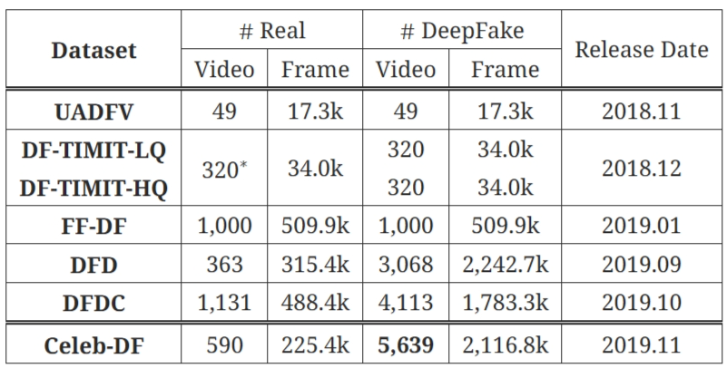

# SRTP

## 伪造

视频

### 伪造方法

|          | 特点                                                         | 检测方法                                                     |
| -------- | ------------------------------------------------------------ | ------------------------------------------------------------ |
| 空间纂改 | 对视频 x-y 中心边缘的视觉内容进行，改变图像或视频的空间特征例如其像素、颜色或形式） | 检查图像或视频的照明或纹理的不规则性、检查噪声模式或利用可以定位图像或视频中的篡改区域 |
| 时间纂改 | 在视频中连接的外壳链上执行（connected chain of casings in the video），加快或减慢视频速度、添加或删除帧、更改视频中对象的轨迹或速度，或者使用灯光或阴影来修改场景的外观 | 评估视频的运动或照明模式，寻找物体运动或轨迹的不规则性，或利用可以发现视频中被篡改区域 |

## DF Detection 1.0

### 检测方法

#### 图片

##### A. 基于网络的方法

1. 迁移学习方法 Transfer Learning：XceptionNet 在 FaceForensic++ 数据集上进行了评估；容易出现过度拟合->光流计算optical flow computation等预处理技术

2. 胶囊网络capsule network增强检测网络效率

#### B. 基于时间一致性的网络

CNN-RNN：验证连续帧之间的连续性，主要由用于处理帧序列的卷积 LSTM 结构组成；视频压缩后性能较差->自动加权算法的 CNN-RNN 系统

#### C. 基于生物信号的方法

眨眼：频率检测

心率：肤色变化

#### 视频

##### 主动 Active Approach

数字水印和数字签名（版权保护）

##### 被动 Passive Approach

捕获视频设备指纹以及视频序列的预定义特征->对提取的特征、视频设备的固有模式和新开发的模式进行可信度评估

### 论文

【1】An Overview of Video Tampering Detection Techniques: State-of-the-Art and Future Directions 视频篡改检测技术概述：最先进的技术和未来的方向——IEEE2023

【2】Unmasking the Illusions: A Comprehensive Study on Deepfake Videos and Images 揭开幻想：对 Deepfake 视频和图像的综合研究——IEEE2024

【3】FaceForensics++: Learning to Detect Manipulated Facial Images FaceForensics++：学习检测经过处理的面部图像——Cornell2019

【4】DeepFake Detection Challenge（DFDC）数据集——Cornell2020

【5】Celeb-DF：用于DeepFake取证的大规模数据集——Cornell2019

【6】DeepfakeBench：Deepfake检测的综合基准——Cornell2023

| 论文       | 模型/方法            | 构建/测试          | 数据集 | 划分 | 预处理 | 训练 |
| ---------- | -------------------- | ------------------ | ------ | ---- | ------ | ---- |
| 1 视频纂改 | DFN&水印watermarking | H.264/AVC 编解码器 |        |      |        |      |
| 5 Celeb-DF |                      |                    |        |      |        |      |
|            |                      |                    |        |      |        |      |

### 数据集

| 名称                                 | 划分                            | 内容                                                 |      | 备注                                                         |      |
| ------------------------------------ | ------------------------------- | ---------------------------------------------------- | ---- | ------------------------------------------------------------ | ---- |
| FaceForensic++（FF-DF）              | 训练集72%、验证集14%和测试集14% | 超过1000个真实视频和4000个伪造视频                   |      | 4种技术制作：DeepFake和FaceSwap用于面部交换，Face2Face和NeuralTexture用于操纵面部表情 |      |
| Celeb-DF v2                          | 训练集70%、验证集15%和测试集15% | 590个原始视频和5639个伪造视频                        |      | 使用改进的Deepfake合成算法生成                               |      |
| Deepfake Detection Challenge（DFDC） |                                 | 超过470GB的视频数据（100000+视频）                   |      | 公共验证集由4000个10s的视频组成，一半是伪造的；最终测试集50%是非源视频数据集中的 |      |
| Deepfake-TIMIT                       |                                 | 640部伪造电影                                        |      |                                                              |      |
| UADFV                                |                                 | 49部Youtube真实视频+59部由FakeAPP的DNN创建的伪造视频 |      |                                                              |      |
| Celeb-DF v1                          |                                 | 408个原始视频+795个伪造视频                          |      |                                                              |      |
| DeepFakeDetection                    |                                 | 363个原始视频+3068多个伪造（DeepFakes）视频          |      |                                                              |      |

根据发布时间和合成算法，我们将UADFV、DF-TIMIT和FF-DF归类为第一代DeepFake数据集，而DFD、DFDC和拟议的Celeb-DF数据集则是第二代。一般来说，第二代数据集在数量和质量上都比第一代有所提高。

数据集信息、数据集划分、统一数据集预处理管道	
怎么为模型统一划分、训练、验证测试以及数据集预处理

#### benchmark信息

FaceForensics++的自动化基准：[基准测试结果 - FaceForensics Benchmark --- Benchmark Results - FaceForensics Benchmark (tum.de)](https://kaldir.vc.in.tum.de/faceforensics_benchmark/)

DFDC：

## 中期

**项目研究存在的主要问题分析及应对思路与措施**（500字内）

### 当前项目存在的主要问题分析

#### 技术层面

- **检测算法性能**：目前的深度伪造检测算法在面对复杂伪造场景时准确率不高，在特定数据集或伪造类型上表现较好，但对其他类型的检测效果差，亟需提高模型的泛化能力。

#### 数据层面

- **数据集**：当前数据集主要来源于欧美地区，存在地域性偏差。此外，数据集中伪造样本来源多样，不同伪造方法影响模型对其他图像的性能。
- **数据划分**：目前尚未确定数据集的训练集与测试集划分，需要更合理的数据划分策略以得到更高效的检测模型。

#### 团队与计划层面

- **进度与分工**：部分任务如数据集划分进度滞后，影响后续工作。团队成员使用不同算法框架，缺乏统一标准，导致代码差异较大，增加了协作成本。

### 应对思路与措施

#### 技术层面

- **提升算法性能**、**增强泛化能力**：引入先进的深度学习架构提升复杂场景中的检测能力。采用增量学习或迁移学习，提升模型在不同类型伪造数据上的适应性。

#### 数据层面

- **数据集扩充**：引入更多地区（如亚洲、非洲）及多种类型的伪造数据，提升模型的多样性和适应性。
- **优化数据划分**：使用k折交叉验证确保训练集和测试集的平衡，避免过拟合或欠拟合。

#### 团队与计划层面

- **明确分工加强协作**：制定详细的任务分解和时间表，建立统一的技术规范和，定期讨论技术和同步进度，提高团队的协作效率。

